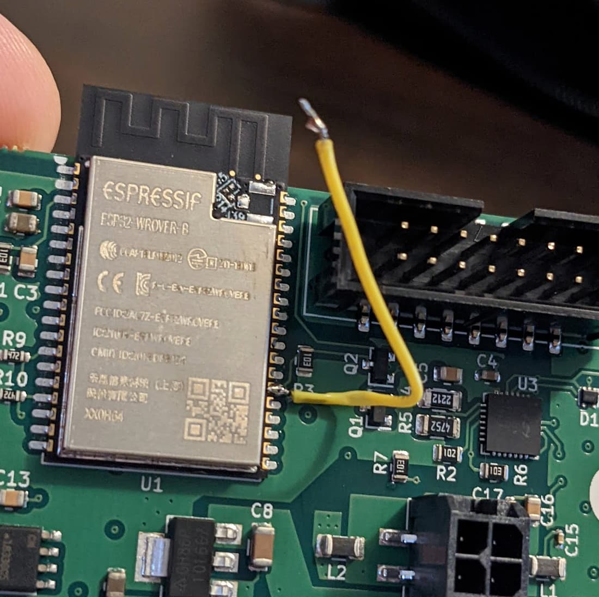

# Device Specific Notes

## Raspberry Pi

A Raspberry Pi is suitable for running Tronbyt, as long as it has sufficient RAM. See the [installation walkthrough video](https://youtu.be/UeHzD0uFxRo).
Check which device you have on the [Raspberry Pi product series page](https://www.raspberrypi.com/news/raspberry-pi-product-series-explained/) and ensure you have more than 512MB of memory, such as 1GB.
512MB may be suitable with some additional configuration.
A 64-bit OS is highly recommended.

### Deploying Tronbyt Manager to a Raspberry Pi

#### Basic setup

If you are starting fresh, use the [Raspberry Pi Imager](https://www.raspberrypi.com/software/) to install Raspberry Pi OS (64-bit) onto an SD card.
Be sure to apply [OS customization settings](https://www.raspberrypi.com/documentation/computers/getting-started.html#advanced-options) to allow your Pi to connect to WiFi, and note the hostname, username and password set.

After putting the SD card into the Pi and booting it, you can connect to the Pi remotely via SSH.
In Windows 10/11, macOS and Linux, this functionality is built in.
Otherwise, [you will need to install 3rd party software like PuTTY](https://www.howtogeek.com/311287/how-to-connect-to-an-ssh-server-from-windows-macos-or-linux/#use-a-third-party-utility-to-ssh-on-windows).
[Open a command prompt](https://www.howtogeek.com/235101/10-ways-to-open-the-command-prompt-in-windows-10/) and type:

```
ssh username@hostname
```

followed by the password, where `username`, `hostname` and the password are all the items you configured during the Pi setup.

#### Automatic install script

```
curl -fsSL https://raw.githubusercontent.com/tronbyt/server-docker-compose/main/rpi_setup.sh | bash
```

#### Manual installation

On your Pi, type or copy/paste the following commands:

```
sudo apt update
sudo apt upgrade -y
```

This will check for and install updates for existing packages.

```
curl -sSL https://get.docker.com | sh
```

This will install Docker using the official Docker script.

Replace `your_username` with the username being used on the Pi before running:

```
sudo usermod -aG docker your_username
```

This will allow you to run Docker commands without re-entering your password every time.
This is an optional but recommended step.
If you run it, log out (type `exit`) and log back in.

Test the install by running:

```
docker run hello-world
```

If you see a message indicating Docker is up and running, you can follow the instructions on the [Server README](https://github.com/tronbyt/server?tab=readme-ov-file#installation).

## Tronbyt Devices

You can obtain a [Tronbyt device](https://pixohardware.store/product/tronbyt-dev-kit/) in order to display images from the Tronbyt server.

### Using the WiFi config portal

The firmware has a rudimentary WiFi config portal page that can be accessed by joining the `TRONBYT-CONFIG` network and navigating to <http://10.10.0.1>.

[WiFi Config Portal How-To Video](https://www.youtube.com/watch?v=OAWUCG-HRDs)

## Tidbyt Gen 1 Devices

### Troubleshooting

#### Error when trying to flash new firmware

If you are trying to flash new firmware to your Tidbyt Gen1 device and the flashing console shows an error like one of the following:

```
Unexpected error: ESP is not in flash boot mode. If your board has a flashing pin, try again while keeping it pressed.
```

```
Failed to connect to Espressif device: Wrong boot mode detected (0x13)! The chip needs to be in download mode.
```

```
Port disconnected during reset attempt
```

```
Couldn't sync to ESP. Try resetting manually. Last error: Couldn't sync to ESP
```

This is a known issue with some Tidbyts, possibly due to 'factory second' status.

There are two possible resolutions:

1. Use a USB-A to USB-C cable instead of a USB-C to USB-C cable, especially through a USB hub. Also try using a different USB cable or different ports on your PC.
2. You can also open the Tidbyt and use tweezers to ground the pin on the chip indicated here:

    

## Kubernetes

### Liveness Probe

You can configure a liveness probe for Kubernetes by sending an HTTP request to `/health`:

```yaml
livenessProbe:
  failureThreshold: 10000
  httpGet:
    path: /health
    port: 8000
```
