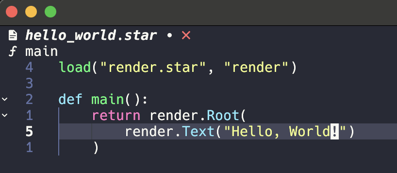

# Tronbyt Docs

[Tronbyt](https://github.com/tronbyt) is an open source connected, smart display that shows weather, stocks, sports, and a whole lot more.

## Getting Started

One of the best parts about Tronbyt is that it's an open platform that you can
build on, publish apps for, and integrate with your own scripts:

* [Build your own pixel-based apps](build/getting_started.md) to display
  on your Tronbyt.
* Deploy and run your apps
  * [Publish your app to the world](publish/community_apps.md)
  * [Push to API](integrate/pushing_apps.md)

### Engage with the community

* Join other Tronbyt users on [Discord](https://discord.gg/HxST87KxdK).
* Get inspired by [checking out all the apps the community has built](https://tronbyt.github.io/apps/).
