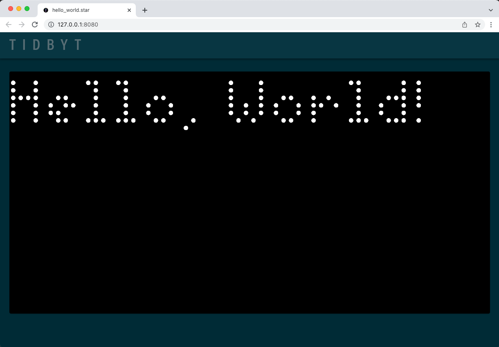

# Build for Tronbyt

To build apps for Tronbyt, use [Pixlet](installing.md). Apps developed with
Pixlet can be served in a browser or pushed to a physical Tronbyt device.

## Requirements
* You've installed [Pixlet](installing.md).
* You are familiar with using a terminal.

## Hello, World!

Pixlet applets are written in a simple, Python-like language called
Starlark. Here's the venerable Hello World program:

```starlark
load("render.star", "render")

def main():
    return render.Root(
        child = render.Text("Hello, World!")
    )
```

Copy the code above and save it as `hello_world.star`. Run it with the
`pixlet serve` command:

```console
pixlet serve hello_world.star
```

You can view the result by navigating to [http://localhost:8080](http://localhost:8080):



### Push to a Tronbyt

If you have a Tronbyt, `pixlet` can push apps directly to it:

```console
# render the bitcoin example
pixlet render examples/bitcoin.star

# login to your Tronbyt account
pixlet login

# list available Tronbyt devices
pixlet devices

# push to your favorite Tronbyt
pixlet push <YOUR DEVICE ID> examples/bitcoin.webp
```

To get the ID for a device, run `pixlet devices`.

### How it works

Pixlet scripts are written in a simple, Python-like language called
[Starlark](https://github.com/google/starlark-go/). The scripts can
retrieve data over HTTP, transform it and use a collection of
_Widgets_ to describe how the data should be presented visually.

The Pixlet CLI runs these scripts on your computer (Mac, Windows or Linux) and renders the result as a WebP
or GIF animation. You can view the animation in your browser, save
it, or even push it to a Tronbyt device with `pixlet push`.

!!! note

    Scripts do not run on Tronbyt devices, only rendered WebP or GIF animations are sent to it.

## What's next?

* Read the [in-depth tutorial on building a more advanced app](tutorials/crypto-tracker.md).
* See our [best practices for authoring apps](authoring-apps.md).
* Check out the references for the [**widgets**](reference/widgets.md)
  and [**modules**](reference/modules.md).
* Learn about [fonts you can use in Pixlet apps](reference/fonts.md).

### Publish your app

Once you've got an app that's looking spiffy, you can
[publish and share it with the community](publish/community-apps.md).
