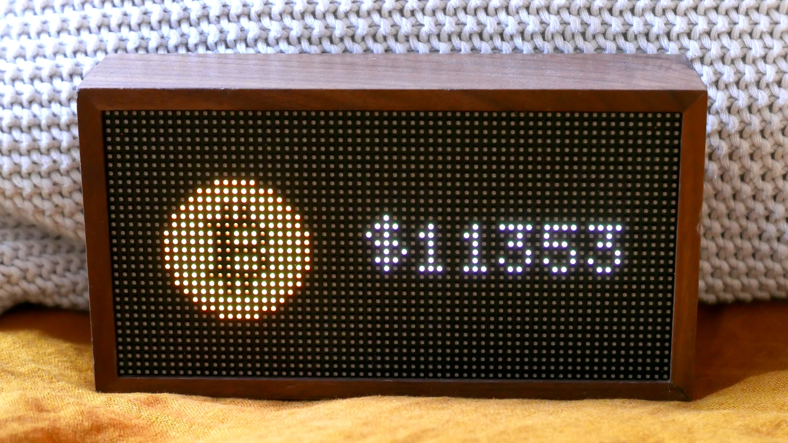
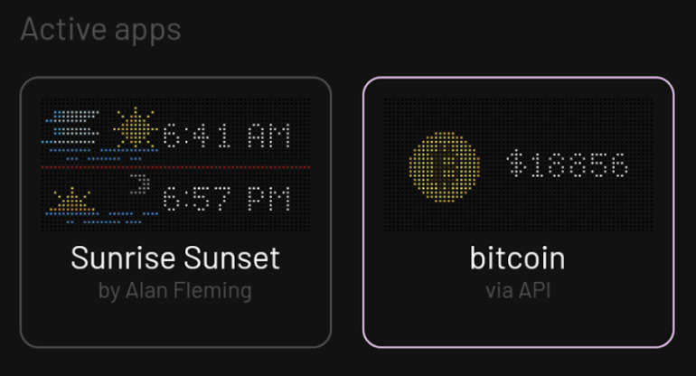

# Pushing Apps

Low resolution applications are of course wonderful in their own
right, but they're even better when you've pushed them to your Tronbyt!
In this chapter, we'll cover how to do that (and more) using the
Tronbyt API.

## Pixlet Push

Let's say you've [built](tutorials/crypto-tracker.md) a beautiful bitcoin
tracker located in `examples/bitcoin.star`. You can easily render this
to a webp image using pixlet:

```
pixlet render examples/bitcoin.star
```

To get the resulting webp displayed on your Tronbyt, you need two
pieces of information: your _Device ID_ and your _API Token_.

To "push" the Bitcoin graphic to your Tronbyt, run:

```
pixlet push "<DEVICE ID>" examples/bitcoin.webp
```

Run `pixlet devices` if you don't know the device ID of your device.
If all goes well, you should see the Bitcoin tracker appear on your Tronbyt:



After a couple of seconds, your Tronbyt will go back to its regular
rotation of apps on display.

## Apps and Installations

Tronbyt comes with a ton of apps out of the box, and you've likely
added a number of them to your Tronbyt already. Each time an app is
added, an _"installation"_ object is created. This is essentially a
record saying "this app is to be run for this
device, using these configuration options". The device will rotate
between displaying installations one at a time.

When pushing a graphic, you can instruct Pixlet to create an
installation for you:

```
pixlet push --installation-id bitcoin "<DEVICE ID>" examples/bitcoin.webp
```

This means the graphic will enter the regular rotation of apps, and
become visible among them in the Tronbyt app.



Keep in mind though, the graphic associated with the installation will
only change if you push a new one. If you really want to stay up to
speed on the price of Bitcoin, you'll have to either keep pushing the
graphic, or look into [publishing your
app](publish/publishing-apps.md). =)
